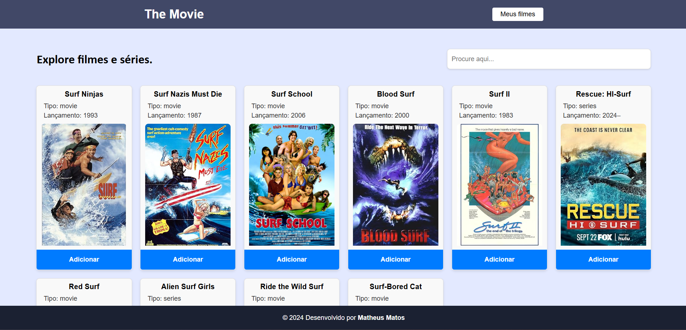

## The Movie.

Este projeto web exibe informações sobre filmes e séries, com a possibilidade do usuário salvar seus filmes favoritos e avaliá-los.

Foi utilizado nesse projeto as tecnologias:
- JavaScript (React) e CSS para o frontend
- Python para o backend
- Banco SQLite.

Para o consumo dos dados, foi utilizado a OMDb API. 

### Banco de dados

Siga o passo a passo para a criação do banco:

- Instale o banco SQLiteStudio em sua máquina
- Crie um novo banco de dados chamado "movies", informando o caminho da pasta backend na hora da criação.

O restante, é só rodar o backend para a criação das tabelas e inserir os dados através da interface.

### 🖥️ Instalação

1. Clone este repositório
```bash
git clone https://github.com/matheusmatosr/the_movie.git
```

#### Backend

Abra o terminal e faça os seguintes comandos:

2. Para acessar a pasta

```bash
cd backend
```

3. Para instalar as dependências

```bash
pip install flask flask-cors sqlite3
```

4. Para rodar o backend:

```bash
python app.py
```

#### Frontend

Abra um novo terminal e faça os seguintes comandos:

2. Para acessar a pasta

```bash
cd frontend
```

3. Para instalar as dependências

```bash
npm install
```

4. Para adicionar o arquivo **.env** no raíz da projeto, ou seja, dentro da pasta do ./frontend e adicione no arquivo a chave com a seu Token da api:

```bash
REACT_APP_API_KEY="seu_token_aqui"
```

5. Para rodar o projeto:

```bash
npm start
```

Acesse o projeto no navegador pelo link gerado no terminal (geralmente http://localhost:3000).


