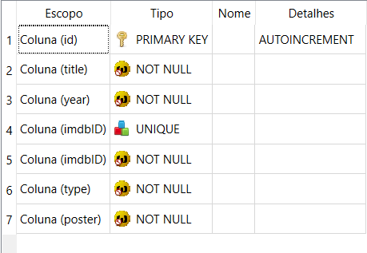
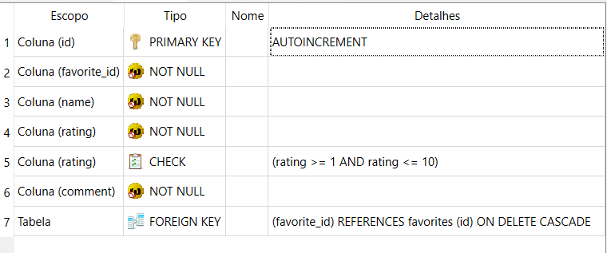

## The Movie.

Este projeto web exibe informações sobre filmes e séries, com a possibilidade do usuário salvar seus filmes favoritos e avaliá-los.

### Decisões Técnicas
Foi utilizado nesse projeto as tecnologias:
- JavaScript (React) e CSS para o frontend
- Python para o backend
- Banco SQLite.

Para o consumo dos dados, foi utilizado a OMDb API. 

### Banco de dados

Siga o passo a passo para a criação do banco:

- Instale o banco SQLiteStudio em sua máquina
- Crie um novo banco de dados chamado "movies", informando o caminho da pasta backend na hora da criação.

O restante, é só rodar o backend para a criação das tabelas e inserir os dados através da interface.

Existem duas tabelas:
- favorites
- reviews

A tabela favotires é dos filmes adicionados pelo usuário que é exibido na página de favoritos.



A tabela reviews é das avaliações dos filmes adicionadas pelo usuário através de um formulário, cada filme possui a sua avaliação.



Canva


### 🖥️ Instalação

1. Clone este repositório
```bash
git clone https://github.com/matheusmatosr/the_movie.git
```

#### Backend

Abra o terminal e faça os seguintes comandos:

2. Para acessar a pasta

```bash
cd backend
```

3. Para instalar as dependências

```bash
pip install flask flask-cors sqlite3
```

4. Para rodar o backend:

```bash
python app.py
```

#### Frontend

Abra um novo terminal e faça os seguintes comandos:

2. Para acessar a pasta

```bash
cd frontend
```

3. Para instalar as dependências

```bash
npm install
```

4. Para rodar o projeto:

```bash
npm start
```

Acesse o projeto no navegador pelo link gerado no terminal (geralmente http://localhost:3000).

### Como Executar os Scripts

O projeto já contém os scripts necessários para rodar o servidor backend e o frontend. Para a execução correta, siga os passos indicados na seção de instalação. Os scripts são configurados para rodar automaticamente na execução de python app.py para o backend e npm start para o frontend.

#### Limitações:

- O sistema não permite login de usuários, o que significa que os favoritos e as avaliações não são persistidos entre diferentes sessões. Essa funcionalidade pode ser implementada no futuro para permitir que os usuários criem contas e façam login.
O banco de dados SQLite não é ideal para um sistema de larga escala. Para produção, seria recomendado utilizar um banco de dados mais robusto, como MySQL ou PostgreSQL.

#### Melhorias Futuras:

- Implementação de login e registro de usuários.
- Melhorias na interface de usuário para facilitar a navegação e a visualização dos filmes e avaliações.
